[TOC]

## GUIDANCE

+ **First run:** 

  Modify the database section in the `settings.py` configuration file to the locally used database.

+ **Configuring environment:**

  ```bash
  pip install -r bbs.txt
  ```

  

+ **Database Migration:**

  ```bash
  python manage.py makemigrations
  python manage.py migrate
  ```

  

+ **Run server:**

  ```bash
  python manage.py runserver
  ```

  You can modify the port you want, for example:

  ```bash
  python manage.py runserver 8000
  ```


+ The following is the flow of the main functions.
  + 
  + 
  + 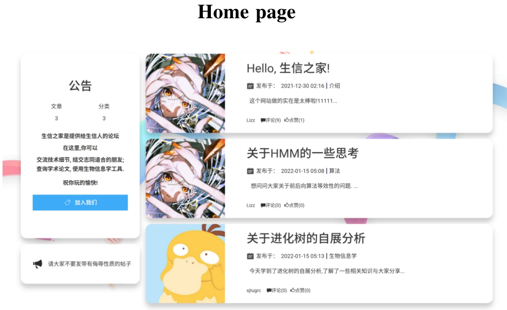
  + 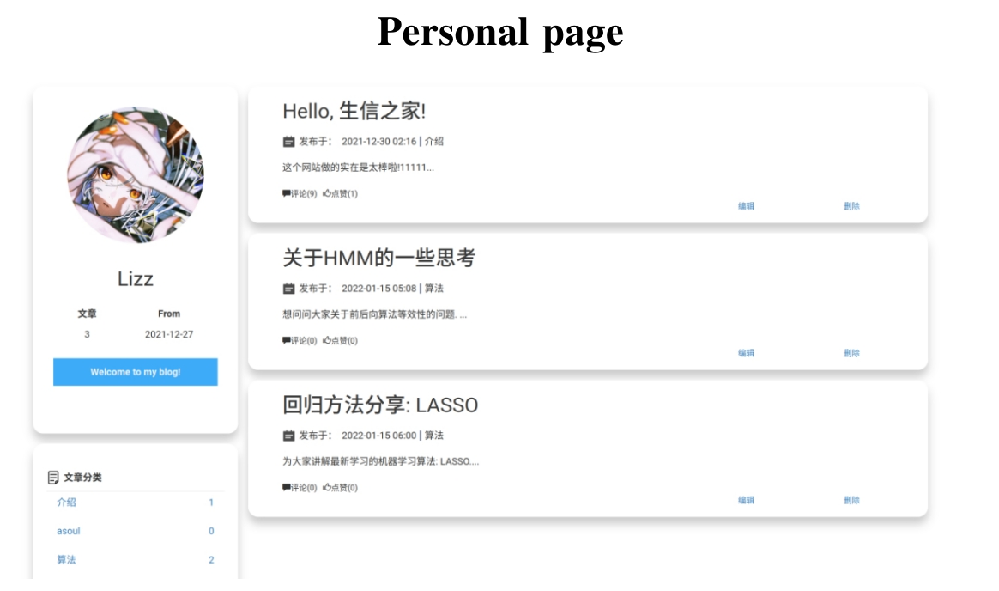
  + 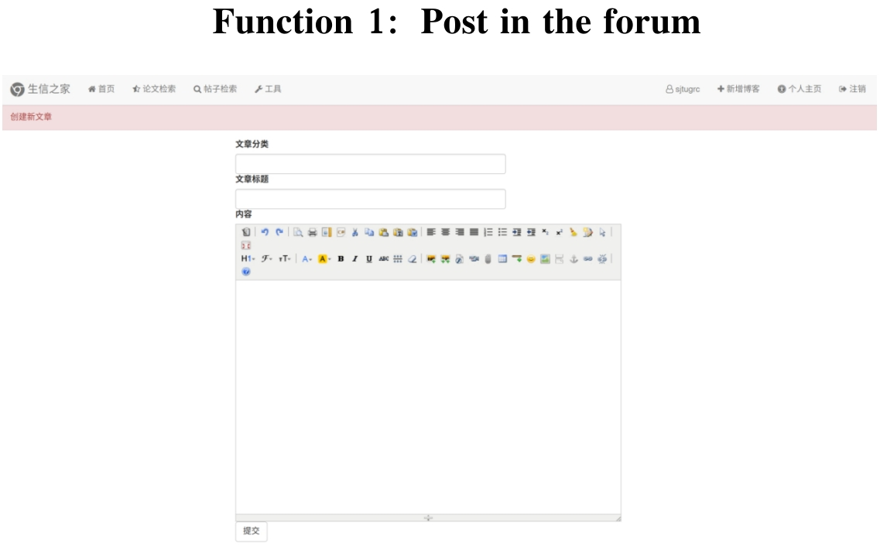
  + 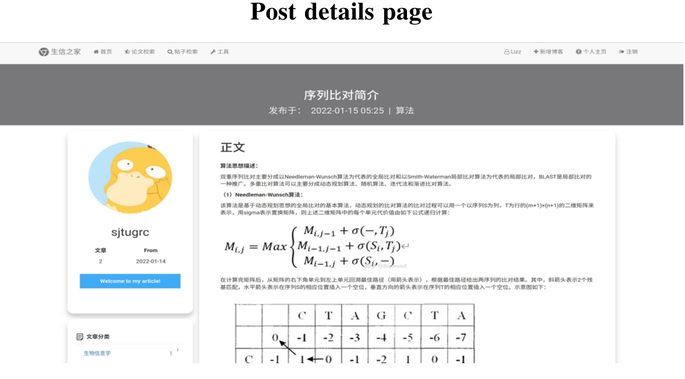
  + 
  + 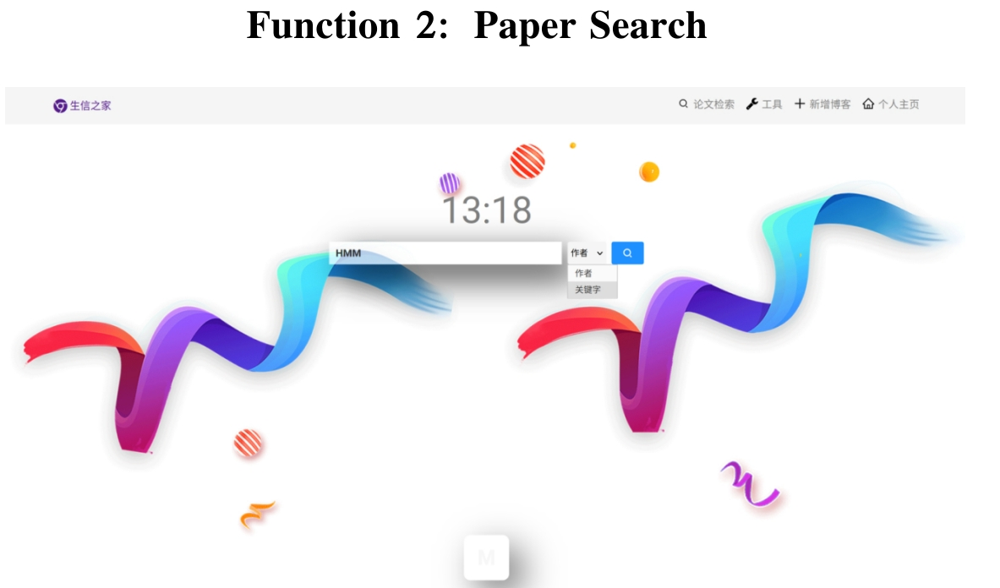
  + 

## Database Design Report


### 1. Project introduction

This part is mainly an introduction to the project

#### 1.1 The origin of the project

​		With the rapid development of biological science and computer science, bioinformatics has emerged rapidly as an interdisciplinary subject. It uses biological and computer science technologies to reveal the biological mysteries hidden behind a large number of complex biological data. At present, the learning materials related to bioinformatics on the Internet are very rich, but it is not easy for beginners to systematically organize the learning materials. Therefore, we hope to use the knowledge we have learned to integrate and classify the excellent parts of the current bioinformatics learning materials, so as to provide a platform for learning and communication for bioinformatics enthusiasts.		

​		This project is mainly a learning forum for bioinformatics-related knowledge, and the benchmarking template is the House of Economics and Management of the National People's Congress. We believe that there is a serious disconnect between the basic courses of the platform and the professional courses of students and letters in the current course arrangement, and many basic knowledge need to be supplemented by oneself, so we hope to build a website that is easy to query and reliable information. At the same time, the experience of seniors and sisters and the exchanges between classmates are also very helpful to our course study, so we finally decided to use it as a forum, and provide discussion and query functions to serve everyone's learning.

#### 1.2 Target user

- Bioinformatics students
- Practitioners in bioinformatics-related industries
- People interested in bioinformatics

#### 1.3 Resources

- PubMed
- Nature Method
- Bioinformatics
- Nature Communications
- BioMed Research International
- The Journal of pathology
- CSDN

### 2. Database Design Process

This part mainly describes the workflow of the project

#### 2.1 Demand analysis

​		Starting from our own experience, we focus on analyzing the relevant problems and needs encountered in the learning process of professional courses. 

- In the learning process, our main needs are: 

  - Case analysis of bioinformatics related tools and methods

  - Discussion and exchange of difficult problems in class/after class

- In the process of scientific research, our main needs are:

  - Search and integration of papers
- Annotation and comprehension of the papers
  - Installation and use of bioinformatics related tools

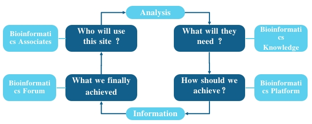

​		Based on the above requirements, we initially divide the functions into discussion and communication sections, thesis sections and tool sections.

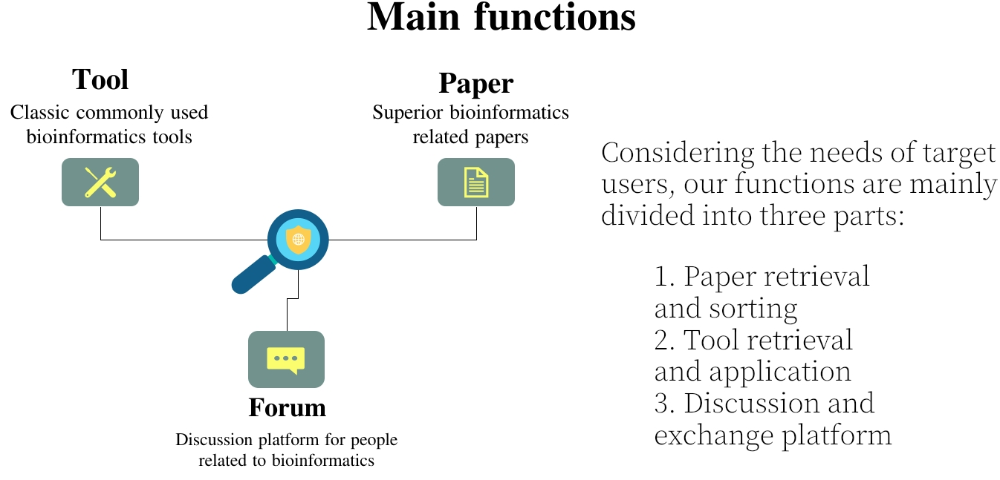

#### 2.2 Concept Design

The conceptual design stage is mainly the drawing of ER diagrams.

- First, the entity is analyzed, and the obtained entity is characterized by attributes. 

  - The most basic entity is the user. We divide users into two categories, one is forum administrators with administrative rights, and the other is ordinary users. Administrator users have modification rights and can modify the information of other users. Ordinary users have the following function and can like and favorite posts that they are interested in.

  - For the specific functions of the three modules, the corresponding entities should also be designed.

    - For the tool section, we define the tool entity, which mainly includes the name and id of the tool (for unified management), as well as the website homepage corresponding to the tool and its main purpose.

    - For the paper section, we define the paper entity, which contains the id and title of the paper, and gives the author's name and the journal from which it came from.

    - For the article part, we divide the articles into two categories, one is the post written and published by the user himself, and the other is the user's comment on the published post, both of which have an id number for unified management.

- The second step is to distinguish the entity's code attributes

  - In order to facilitate unified management, we set a corresponding ID for each entity to distinguish it, and this ID is automatically assigned by the system

- The third step is to establish the connection between the entities		

  - The main link between users and articles is submission, which is a one-to-many relationship, that is, a user can submit multiple articles, but an article can only belong to one user.	

  - The connection between the users and the paper is also a one-to-many connection, and users can collect and classify their own papers through this connection.

  - The relationship between users and tools is also a one-to-many relationship, and users can bookmark their commonly used tools

    

    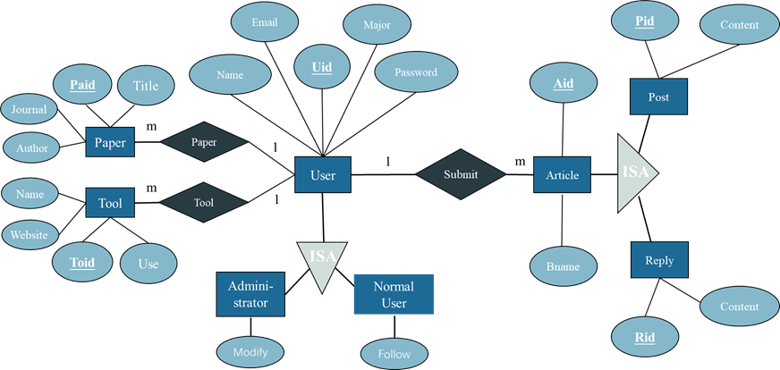

​		Finally, the ER diagram as shown in the figure above is obtained, and it is confirmed through the ER diagram that all requirements can be met.

#### 2.3 Logic design

The logic design is mainly to get the relational table. 

- Based on the above ER diagram. We get the following table

  - Entity table:

    - User
  
    | Uid  | Name | Email | Password | Major |
    | :--: | :--: | :---: | :------: | :---: |
    | int  | char | char  |   char   | char  |
	
	  - Post
	
	  | Uid  | Bname | Pid  | Content |
	  | :--: | :---: | :--: | :-----: |
	  | int  | char  | int  |  char   |
	
	  - Reply
	
	  | Uid  | Bname | Rid  | Content |
	  | :--: | :---: | :--: | :-----: |
	  | int  | char  | int  |  char   |
	
	  - Paper
	
	  | Paid | Title | Journal | Author |
	  | :--: | :---: | :-----: | :----: |
	  | int  | char  |  char   |  char  |
	
	  - Tool
	
	  | Toid | Name | Website | Use  |
	  | :--: | :--: | :-----: | :--: |
	  | int  | char |  char   | char |
    
  - Relation table:
  
    - User-Article
  
    | Uid  | Aid  |
    | :--: | :--: |
    | int  | int  |
    - User-Paper
    | Uid  | Paid |
    | :--: | :--: |
    | int  | int  |
    - User-Total
    | Uid  | Toid |
    | :--: | :--: |
    | int  | int  |

#### 2.4 Physical realization

- 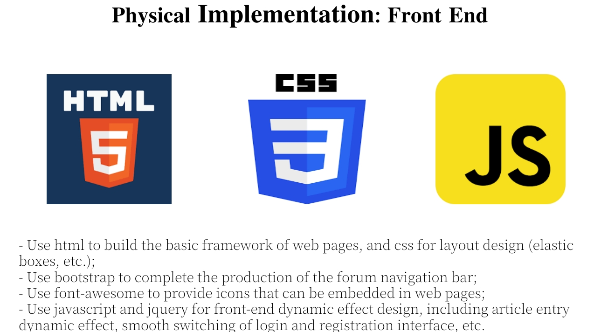
- - 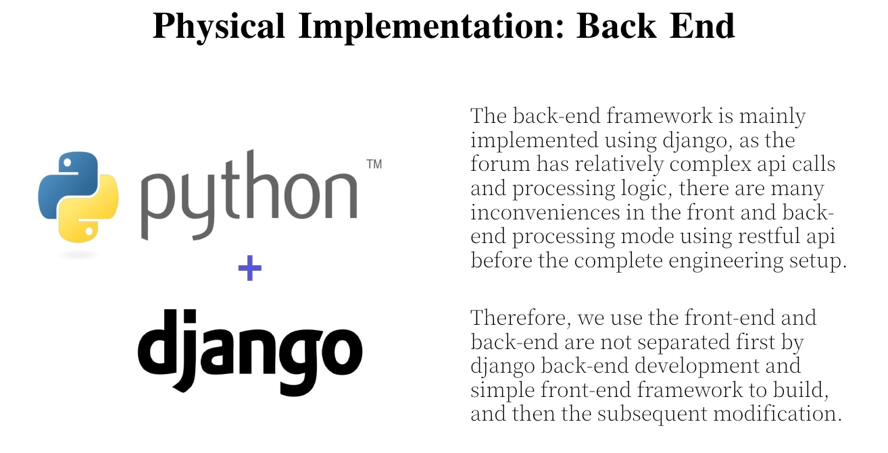


- 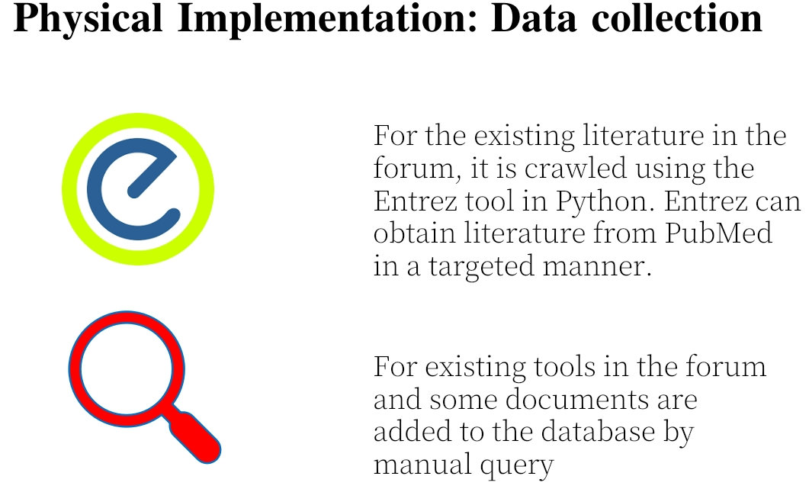

### 3. Function realization and display

​		We have established a forum that provides communication and retrieval functions, covering bioinformatics related papers and tools, as well as posts by existing users. 

### 4. Existing problems and future prospects

#### 4.1 Existing problems

​		In terms of data acquisition, due to the rush of time, we did not get too much data, but only carried out some retrievals roughly, and we will further improve the data we provide in the future. 

​		In addition, there are some functions that are not yet perfect and still need to be further improved in the future, and user rights management also needs to be further refined.

#### 4.2 Future prospects

​		With the continuous development of the field of life sciences, we have accumulated a large amount of bioinformatics data. With the increasing demand for research on life and disease, the importance of biological data is also increasing, and bioinformatics research has become more and more popular.		

​		We hope to establish a bioinformatics forum as influential as the House of Economics and Management of the National People's Congress for the use of bioinformatics related people, so that the discipline of bioinformatics can be carried forward and better benefit the human society.

